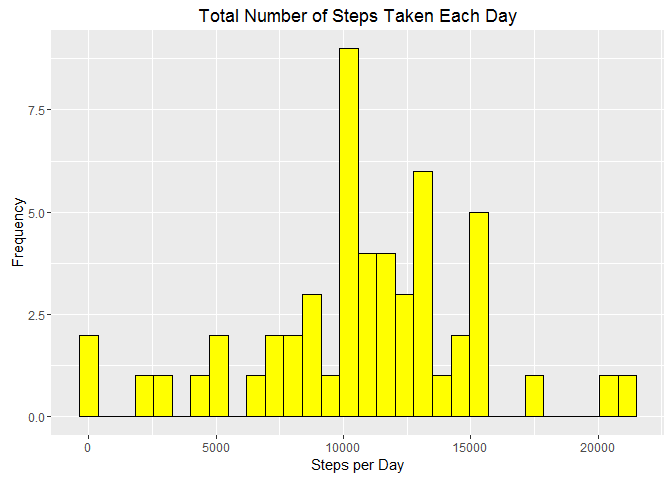
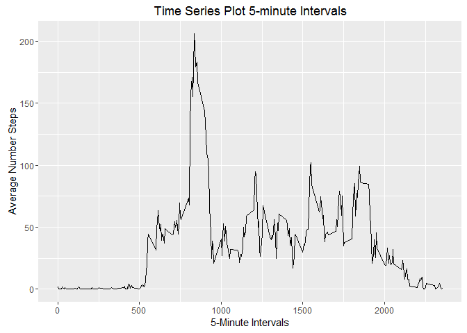
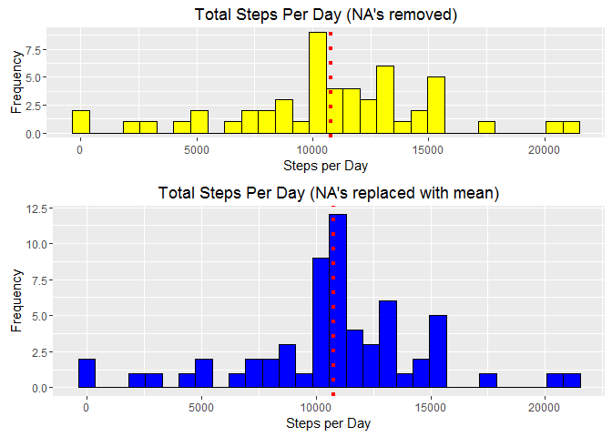
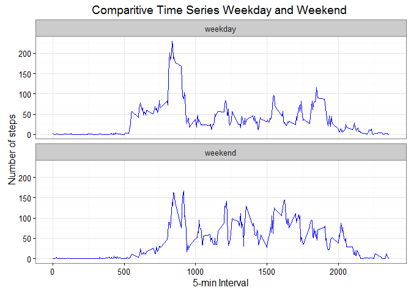

# Reproducible Research: Peer Assessment 1
Vincent Roy  
September 12, 2016  
It is now possible to collect a large amount of data about personal movement using activity monitoring devices such as a Fitbit, Nike Fuelband, or Jawbone Up. These type of devices are part of the “quantified self” movement – a group of enthusiasts who take measurements about themselves regularly to improve their health, to find patterns in their behavior, or because they are tech geeks. But these data remain under-utilized both because the raw data are hard to obtain and there is a lack of statistical methods and software for processing and interpreting the data.

This assignment makes use of data from a personal activity monitoring device. This device collects data at 5 minute intervals through out the day. The data consists of two months of data from an anonymous individual collected during the months of October and November, 2012 and include the number of steps taken in 5 minute intervals each day.

The data for this assignment can be downloaded from the course web site:

    Dataset: Activity monitoring data [52K]


The variables included in this dataset are:

    steps: Number of steps taking in a 5-minute interval (missing values are coded as NA)
    date: The date on which the measurement was taken in YYYY-MM-DD format
    interval: Identifier for the 5-minute interval in which measurement was taken

The dataset is stored in a comma-separated-value (CSV) file and there are a total of 17,568 observations in this dataset.
# Loading and preprocessing the data

# What is mean total number of steps taken per day? 
1. Calculate the total number of steps taken per day(ignoring NA's)
2. Make a histogram of the total number of steps taken each day
3. Calculate and report the mean and median of the total number ##    of steps taken per day

```r
        steps.sum <- aggregate(activity$steps, by=list(activity$date), FUN=sum)
        head(steps.sum)
```

```
##      Group.1     x
## 1 2012-10-01    NA
## 2 2012-10-02   126
## 3 2012-10-03 11352
## 4 2012-10-04 12116
## 5 2012-10-05 13294
## 6 2012-10-06 15420
```

```r
    # Rename the attributes
        names(steps.sum) <- c("date", "total.steps")    
        summary(steps.sum)
```

```
##       date             total.steps   
##  Min.   :2012-10-01   Min.   :   41  
##  1st Qu.:2012-10-16   1st Qu.: 8841  
##  Median :2012-10-31   Median :10765  
##  Mean   :2012-10-31   Mean   :10766  
##  3rd Qu.:2012-11-15   3rd Qu.:13294  
##  Max.   :2012-11-30   Max.   :21194  
##                       NA's   :8
```

```r
        p.steps.sum <- ggplot(data = steps.sum, mapping = aes(x = total.steps)) +         
            geom_histogram(fill = "yellow", colour = "black", bins = 30) +
        scale_x_continuous("Steps per Day") + 
        scale_y_continuous("Frequency") + ggtitle("Total Number of Steps Taken Each Day")
        print(p.steps.sum)
```

```
## Warning: Removed 8 rows containing non-finite values (stat_bin).
```

<!-- -->

```r
    knitr::opts_chunk$set(echo = TRUE)
```
# Mean and median of steps taken per day:


```r
    mean(steps.sum$total.steps, na.rm = TRUE)
```

```
## [1] 10766.19
```

```r
    median(steps.sum$total.steps, na.rm = TRUE)
```

```
## [1] 10765
```

```r
knitr::opts_chunk$set(echo = TRUE)
```
# What is the average daily activity pattern?
1. A time series is plotted (i.e. type = "l") of the 5-minute interval (x-axis) and the average number of steps taken, averaged across all days (y-axis)
    

```r
    steps.int <- aggregate(steps ~ interval, activity, mean)
    head(steps.int)
```

```
##   interval     steps
## 1        0 1.7169811
## 2        5 0.3396226
## 3       10 0.1320755
## 4       15 0.1509434
## 5       20 0.0754717
## 6       25 2.0943396
```

```r
    p.steps.int <-  ggplot(steps.int, aes(x = interval, y = steps)) + geom_line() + labs(title = "Time Series Plot 5-minute Intervals", x = "5-Minute Intervals", y = "Average Number Steps")
    print(p.steps.int)
```

<!-- -->
# Which 5-minute interval, on average across all the days in the dataset, contains the maximum number of steps?

```r
   steps.int$interval[which.max(steps.int$steps)]
```

```
## [1] 835
```

```r
knitr::opts_chunk$set(echo = TRUE)
```
# Imputing missing values

(Note that there are a number of days/intervals where there are missing values (coded as NA). The presence of missing days may introduce bias into some calculations or summaries of the data.)
1. Calculate and report the total number of missing values in the dataset (i.e. the total number of rows with NAs)
2. Devise a strategy for filling in all of the missing values in the dataset. The strategy does not need to be sophisticated. For example, you could use the mean/median for that day, or the mean for that 5-minute interval, etc.
3. Create a new dataset that is equal to the original dataset but with the missing data filled in.
4. Make a histogram of the total number of steps taken each day and Calculate and report the mean and median total number of steps taken per day. 

```r
summary(activity)
```

```
##      steps             date               interval     
##  Min.   :  0.00   Min.   :2012-10-01   Min.   :   0.0  
##  1st Qu.:  0.00   1st Qu.:2012-10-16   1st Qu.: 588.8  
##  Median :  0.00   Median :2012-10-31   Median :1177.5  
##  Mean   : 37.38   Mean   :2012-10-31   Mean   :1177.5  
##  3rd Qu.: 12.00   3rd Qu.:2012-11-15   3rd Qu.:1766.2  
##  Max.   :806.00   Max.   :2012-11-30   Max.   :2355.0  
##  NA's   :2304
```

```r
sum(is.na(activity$steps))
```

```
## [1] 2304
```

```r
knitr::opts_chunk$set(echo = TRUE)
```
# The dataset has 2304 NA's = 13.1% of the intervals
# Replace the missing data with the mean for the each interval

```r
    activity2 <- activity
    nas <- is.na(activity2$steps)
    head(nas)
```

```
## [1] TRUE TRUE TRUE TRUE TRUE TRUE
```

```r
    steps.int2 <- tapply(activity2$steps, activity2$interval, mean, na.rm=TRUE, simplify=TRUE)
    activity2$steps[nas] <- steps.int2[as.character(activity2$interval[nas])]
    head(activity2)
```

```
##       steps       date interval
## 1 1.7169811 2012-10-01        0
## 2 0.3396226 2012-10-01        5
## 3 0.1320755 2012-10-01       10
## 4 0.1509434 2012-10-01       15
## 5 0.0754717 2012-10-01       20
## 6 2.0943396 2012-10-01       25
```

```r
    sum(is.na(activity2$steps)) # confirm NA replacements
```

```
## [1] 0
```

```r
knitr::opts_chunk$set(echo = TRUE)
```
# Total number of steps taken per day and plot histogram (NA's filled) :

```r
    steps.sum2 <- aggregate(activity2$steps, by=list(activity2$date), FUN=sum)
    names(steps.sum2) <- c("date", "total.steps")
    head(steps.sum2)
```

```
##         date total.steps
## 1 2012-10-01    10766.19
## 2 2012-10-02      126.00
## 3 2012-10-03    11352.00
## 4 2012-10-04    12116.00
## 5 2012-10-05    13294.00
## 6 2012-10-06    15420.00
```

```r
    par(mfrow=c(1,2))
    # Orignal histogram with NA's removed:
    p1 <- ggplot(data = steps.sum, mapping = aes(x = total.steps)) +         
            geom_histogram(fill = "yellow", colour = "black", bins = 30) +
        scale_x_continuous("Steps per Day") + 
        scale_y_continuous("Frequency") + ggtitle("Total Steps Per Day (NA's removed)") +
        geom_vline(xintercept = mean(steps.sum2$total.steps), linetype="dotted", color = "red", size=1.5)
        #print(p.steps.sum)
        
    # Histogram with NA's replaced:    
    p2 <- ggplot(data = steps.sum2, mapping = aes(x = total.steps)) +         
            geom_histogram(fill = "blue", colour = "black", bins = 30) +
            scale_x_continuous("Steps per Day") + 
            scale_y_continuous("Frequency") + ggtitle("Total Steps Per Day (NA's replaced with mean)") +
        geom_vline(xintercept = mean(steps.sum2$total.steps), linetype="dotted", color = "red", size=1.5)
    #print(p.steps.sum2)
    grid.arrange(p1, p2, nrow = 2, heights = c(0.45, 0.65))
```

```
## Warning: Removed 8 rows containing non-finite values (stat_bin).
```

<!-- -->

```r
knitr::opts_chunk$set(echo = TRUE)
```
# What is the impact of imputing missing data on the estimates of the total daily number of steps? 
There is a higher frequency of data around the mean number of steps with the filled dataset. 

# Do these values differ from the estimates from the first part of the assignment? 
As per the results, the mean is now equal the median whereas in the first set the mean was slighly less than the median.
Mean and median of steps taken per day of filled df:

```r
    mean(steps.sum2$total.steps)
```

```
## [1] 10766.19
```

```r
    median(steps.sum2$total.steps)
```

```
## [1] 10766.19
```

```r
    mean(steps.sum2$total.steps)-mean(steps.sum2$total.steps)
```

```
## [1] 0
```

```r
    median(steps.sum2$total.steps)-median(steps.sum2$total.steps)
```

```
## [1] 0
```

```r
knitr::opts_chunk$set(echo = TRUE)
```
## What are the differences in activity patterns between weekdays and weekends?
Solution:
1. Insert column that indicates the day of the week
2. Subset the table into weekends (Saturday and Sunday) and weekdays (Monday through Friday).
3. Average steps per interval for each data set.
4. Side by side plots for comparison. 

There seems to be one peak steps intevals cluster during the week, whereas on the weekend the peak step inteval clustering is distributed across the weekend. Further investigation into the type of stepping activity is warranted to understand the difference.

```r
    activity3 <- activity2
    activity3$weekday<-weekdays(activity2$date)
    activity3$daytype<- as.factor(c("weekend", "weekday"))
    activity3[activity3$weekday == "Sunday" | activity3$weekday == "Saturday" ,5]<- factor("weekend")
    activity3[!(activity3$weekday == "Sunday" | activity3$weekday == "Saturday"),5]<- factor("weekday")
    str(activity3)
```

```
## 'data.frame':	17568 obs. of  5 variables:
##  $ steps   : num  1.717 0.3396 0.1321 0.1509 0.0755 ...
##  $ date    : Date, format: "2012-10-01" "2012-10-01" ...
##  $ interval: int  0 5 10 15 20 25 30 35 40 45 ...
##  $ weekday : chr  "Monday" "Monday" "Monday" "Monday" ...
##  $ daytype : Factor w/ 2 levels "weekday","weekend": 1 1 1 1 1 1 1 1 1 1 ...
```

```r
 # Subset dataset by weekend and weekday
    activity3we <- subset(activity3, daytype == "weekend")
    head(activity3we)
```

```
##      steps       date interval  weekday daytype
## 1441     0 2012-10-06        0 Saturday weekend
## 1442     0 2012-10-06        5 Saturday weekend
## 1443     0 2012-10-06       10 Saturday weekend
## 1444     0 2012-10-06       15 Saturday weekend
## 1445     0 2012-10-06       20 Saturday weekend
## 1446     0 2012-10-06       25 Saturday weekend
```

```r
    activity3wd <- subset(activity3, daytype == "weekday")
    head(activity3wd)
```

```
##       steps       date interval weekday daytype
## 1 1.7169811 2012-10-01        0  Monday weekday
## 2 0.3396226 2012-10-01        5  Monday weekday
## 3 0.1320755 2012-10-01       10  Monday weekday
## 4 0.1509434 2012-10-01       15  Monday weekday
## 5 0.0754717 2012-10-01       20  Monday weekday
## 6 2.0943396 2012-10-01       25  Monday weekday
```

```r
 #  combine to one dataset
    activity3all <-  rbind(activity3wd, activity3we)
 # Aggregate steps by 5-minute intervals averaged by weekend or weekday in each data subset
    steps.int.dt <- aggregate(steps ~ interval + daytype, activity3all, mean)
    steps.int.we <- aggregate(steps ~ interval + daytype, activity3we, mean)
    steps.int.wd <- aggregate(steps ~ interval + daytype, activity3wd, mean)
    
#   Plot time series plot side by side
    p3 <- ggplot(steps.int.dt, aes(x=interval, y=steps)) + 
        geom_line(color="blue") + 
        facet_wrap(~ daytype, nrow=2, ncol=1) +
        labs(x="5-min Interval", y="Number of steps", title = "Comparitive Time Series Weekday and Weekend ") +
        theme_bw()
    print(p3)
```

<!-- -->

```r
knitr::opts_chunk$set(echo = TRUE)
```
    


